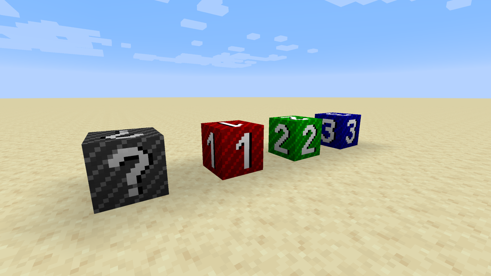

# Test Block Mod

This is a simple, proof-of-concept, Fabric mod for Minecraft 1.16 that adds a single technical block that, if added to vanilla, map makers, server developers and resource pack artists could retexture or remodel without overriding blocks that are obtainable in survival mode. The block supports up to 1024 different variants/models; this number is arbitrary, but I'd say it's a reasonable compromise (it can't be unlimited due to technical limitations).

## Background

At the moment, Minecraft Java Edition offers a way to retexture/remodel items without the need to override the default appearance of the item in question, through the use of the `CustomModelData` NBT tag. The same is unfortunately not possible for blocks (at least at the moment) due to technical limitations.

A workaround that is currently being used is to take a single block that supports a large number of block states, such as Note Blocks (which, for example, have 768 possible states) or Mushroom Blocks and apply a different model for each state, which isalready possible through resource packs.

While this is a clever trick, it does mean that you have to override, and therefore lose, some blocks. For survival maps/servers, this also means making sure that such blocks are not obtainable through usual means (which is kinda of a shame; imagine not being able to craft a Note Block).

The simplest solution that Mojang could provide would be to add a technical block intended for use by resource pack artists, which, just like the blocks mentioned above, would have a large number of states, and therefore be able to support a large number of custom models, through already existing resource pack features. This mod is an example of how that block could work.

Obviously, much better solutions are possible, but they would likely require non-trivial technical changes to the game and are therefore less likely to be implemented. This, instead, is as easy as just adding a block.

## Screenshots

## License

This work is released under the public domain.
